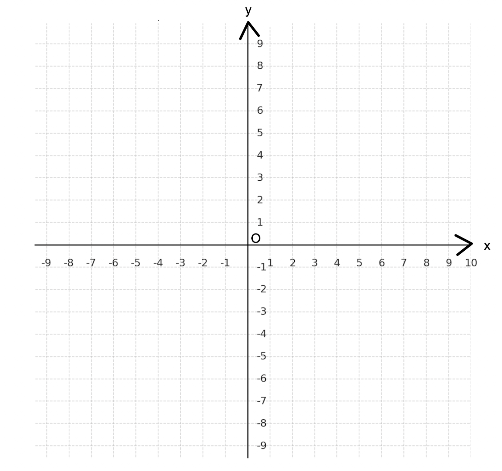
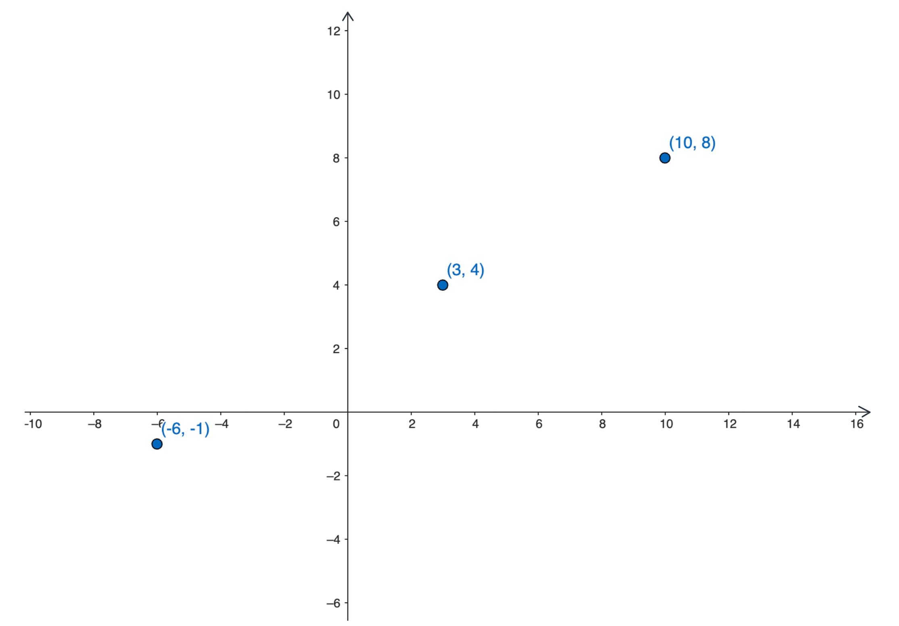
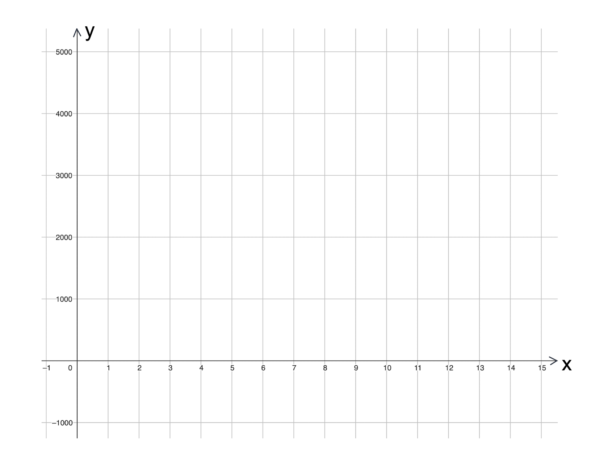

## Gruppdiskussion: linjära ekvationer och grafer.

Matematik 1b

[Wanmin Liu](https://wanminliu.github.io/matte/)

#### 1. Välj en av uppgifter nedan. Markera punkterna i ett koordinatsystem. Därefter bestäm ekvationen för linjen som går genom punkterna.

A. $(3,\ -4)$ och $(-1, \ 8)$.  
B. $(-2,\ 1)$ och $(1, \ -5)$.  
C. $(3,\ 7)$ och $(-2, \ -6)$.  
D. $(-1,\ 5)$ och $(2, \ -7)$.  

---

#### 2.  Välj en av uppgifterna nedan. Bestäm ekvationen för en linje som har $k$-värdet och går genom punkten nedan.

A. $k=\frac{2}{3}$ och punkten $(-1, \ 3)$.  
B. $k=-\frac{4}{3}$ och punkten $(1, \ -2)$.  
C. $k=\frac{3}{5}$ och punkten $(-3, \ -2)$.  
D. $k=-\frac{3}{4}$ och punkten $(2, \ 5)$.  

#### 3. Linjen $y=3x-6$ skär x-axeln med punkten $A$ och y-axeln med punkten $B$. Origon är $O$. 

A. Vad är $k$- och $m$-värdet för linjen?  
B. Vilka är koordinaterna för punkterna $A$ och $B$?   
C. Vad är arean av triangeln $OAB$?

---

#### 4. I ett koordinatsystem finns tre punkter som markeras i figuren. 

* Wilma anser att dessa tre punkter ligger på en rät linje.
* Madeleine menar att punkterna inte alls liger på en rät linje utan att det bara är så det ser ut.

Undersök vem som har rätt.

---

#### 5. Gruppen väljer två av uppgifterna nedan. Förklarar för varandra hur vi kan skriva om linjens ekvation till $k$-form och bestämma linjens lutning.

A. $x=3y-6$.  
B. $2x+4y+6=0$.  
C. $3x-6y-12=0$.  
D. $4x-2y+3=0$.

---

#### 6. Den linjära funktionen $y=5000-400x$ beskriver hur många meter Lina har kvar till mål när hon sprungit $x$ varv på en löparbana.

A. Vad är $k$- och $m$-värdet för linjen?  
B. Rita grafen i koordinaten.  
C. Hur många meter springer Lina?  
D. Hur många varv springer hon totalt?  

 

