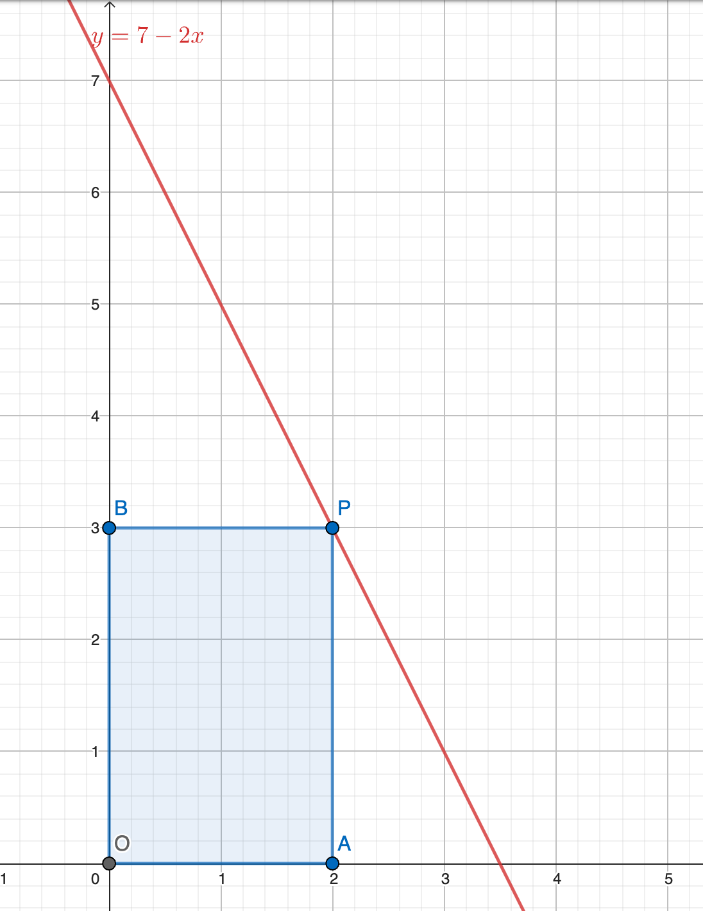
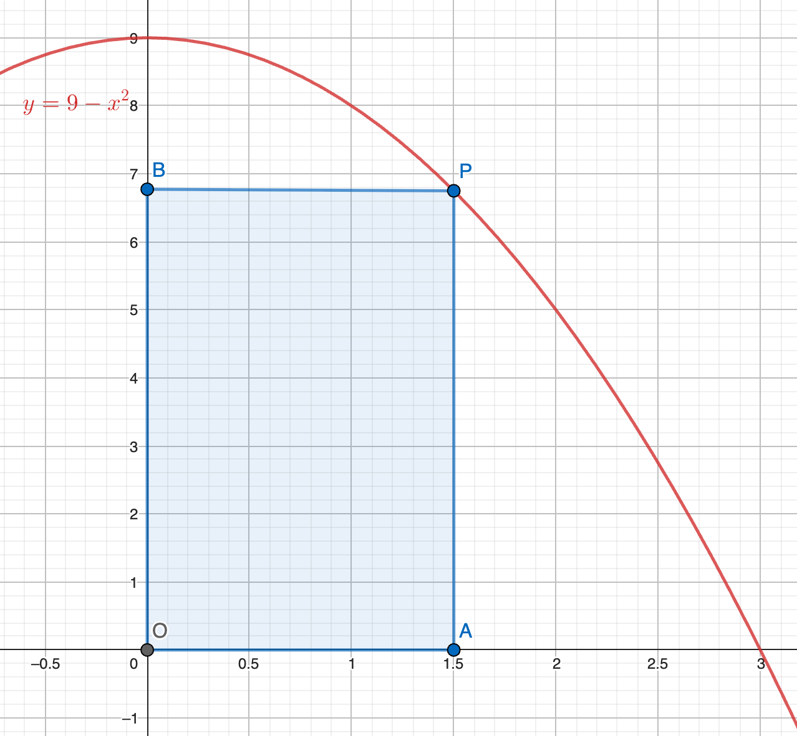
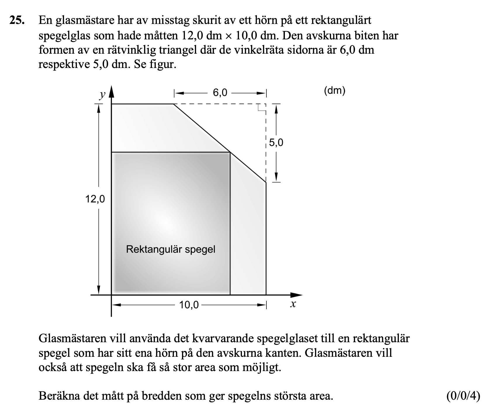
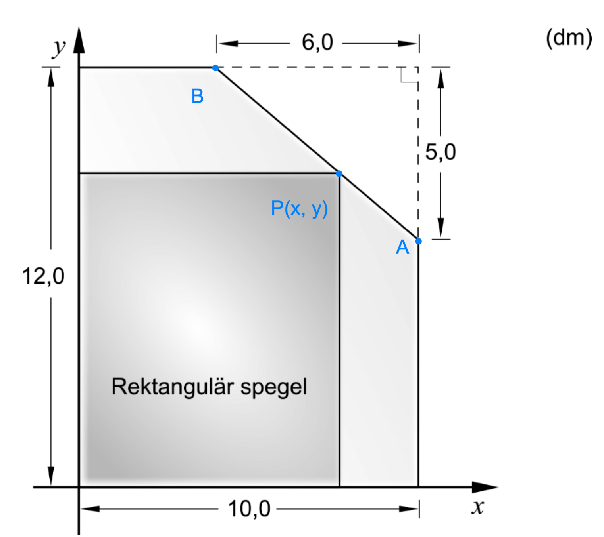
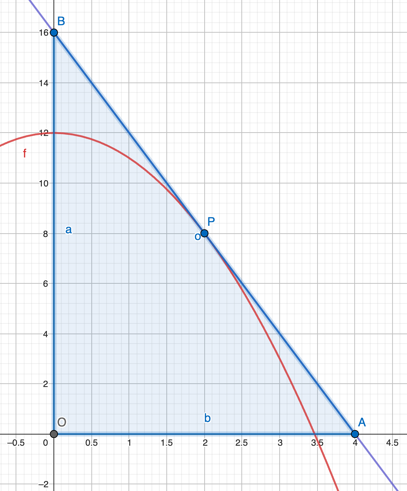
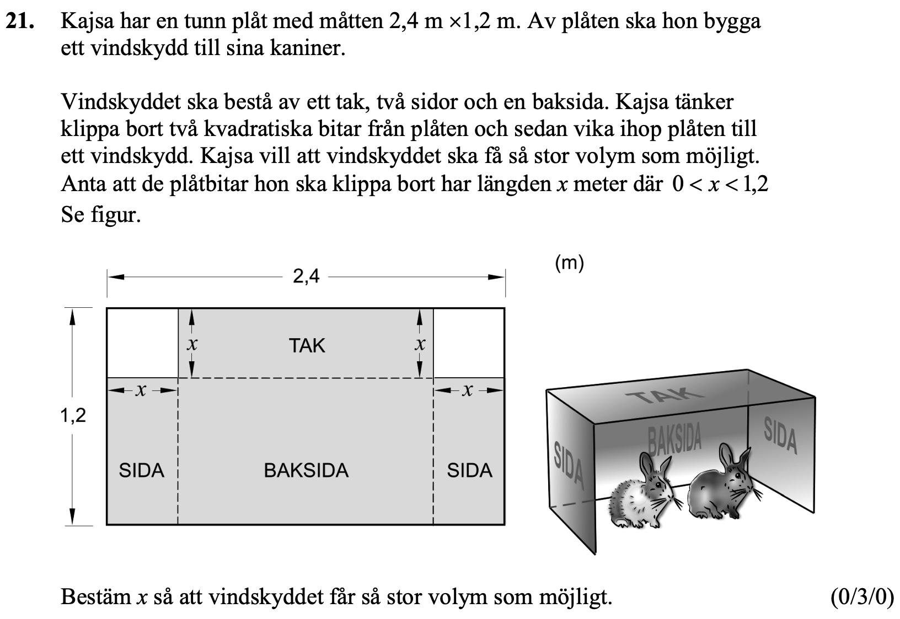

## Extremvärdsproblem

[Wanmin Liu](https://wanminliu.github.io/matte/)

20251023

Ma3c

Planering.

Pass 1.

* Leksaksmodell och två metoder för att bestämma det extrem värdet. 5 min.
* Diskutera likheter och skillnader i par mellan Uppgifterna 4253 och 4251. 5 min.
* Gå igenom detaljerna för 4253.  Två olika metoder. 10 min.
* Läs Ma3c-Np-vt-2014-25. 5 min. (projicera till tavlan)
* Diskutera likheter och skillnader mellan Uppg. 4253 och Ma3c-Np-vt-2014-25. 5 min.
* **Tips**. Rita tre punkter A, P, B i bilden. 
* Elever kör Ma3c-Np-vt-2014-25 individuellt. 20 min.
* Om några elever klarar detta kan de göra uppgiften Np-2020-Peking.
* Sista 10 min. Vi tittar på lösningar av Ma3c-Np-vt-2015-25. (projicera till tavlan)

Pass 2.

* Läs Ma3c-Np-ht-2014-21. 5 min. (projicera till tavlan)
* Diskutera i par: Vad är volymen $V(x)$ som en funktion av $x$? 3 min. Vi skriver $V(x)$ på tavlan. 
* Elever kör Ma3c-Np-ht-2014-21 individuellt. 20 min.
* Vi tittar på lösningar av Ma3c-Np-ht-2014-21. 5 min. (projicera till tavlan)
* Aktivitet i Matematik Origo: Vilken volym är störst? Säg till eleven att de inte behöver göra funktionsvärdetabellen. **Tips**. Rita i tavlan. Vad är volymen $V(x)$ som en funktion av $x$? 5 min
* Elever kör aktivitet till slut av Pass 2.

## Pass 1.

### Tänk genom att använda leksaksmodellen.

Kom bara ihåg **leksaksmodell**.

 - $y=f(x)=x^2$ har **minsta** värdet på $x=0$. $f'(x)=2x$. Tecknet nära $x=0$ för $f'(x)$ har formen: $- \ 0 \ +$. $f''(x)=2>0$. Vi har $f'(0)=0$ och $f''(0)>0$.
 - $y=g(x)=-x^2$ har **största** värdet på $x=0$. $g'(x)=-2x$. Tecknet nära $x=0$ för $g'(x)$ har formen: $+ \ 0 \ -$. $g''(x)=-2<0$. Vi har $g'(0)=0$ och $g''(0)<0$. 

* Metod 1. Använda första ordningens derivata och **dess tecken** för att bestämma det extrem värdet. 

Om $f'(x)$ i närheten av $x=x_0$ har teck formen $- \ 0 \ +$ (dvs ändrar tecken från negativt till positivt), har $f(x)$ ett lokalt minimum i $x_0$.

Om $f'(x)$ i närheten av $x=x_0$ har teck formen $+ \ 0 \ -$ (dvs ändrar tecken från positivt till negativt), har $f(x)$ ett lokalt maximum i $x_0$.

* Metod 2. Använda första ordningens derivata och **andra ordningens derivata** för att bestämma det extrem värdet.

Om $f'(x_0)=0$ och $f''(x_0)>0$ så är $f(x)$ lokal minimum i $x_0$.

Om $f'(x_0)=0$ och $f''(x_0)<0$ så är $f(x)$ lokal maximum i $x_0$.

------

Steg för att hitta extremvärden av $f(x)$ med första derivatans teckenmetod:

1. Beräkna derivatan $f'(x)$.
2. Lös ekvationen $f'(x)=0$. Beteckna lösningen som $x=x_0$.
3. Analysera teckenbyte av $f'(x)$ nära $x=x_0$: 
  - $+ \ 0 \ - \Longleftrightarrow$ $f(x)$ har ett lokalt maximum vid $x_0$; 
  - $- \ 0 \ + \Longleftrightarrow$ $f(x)$ har ett lokalt minimum vid $x_0$.
4. Beräkna extremvärdena.

------

Steg för att hitta extremvärden av $f(x)$ med första och andra derivatan:

1. Beräkna derivatan $f'(x)$.
2. Lös ekvationen $f'(x)=0$. Beteckna lösningen som $x=x_0$.
3. Beräkna andra derivatan $f''(x)$.
4. Använd andraderivatatestet:
   - $f''(x_0)<0\Longleftrightarrow$ $f(x)$ har ett lokalt maximum vid $x_0$; 
   - $f''(x_0)>0\Longleftrightarrow$ $f(x)$ har ett lokalt minimum vid $x_0$.
5. Beräkna extremvärdena.

------

**Diskutera i par. Ingen lösning krävs, och inga detaljer behövs. Diskutera likheter och skillnader mellan de två uppgifterna.**

#### Exempel 4253

I figuren är linjen $y=7-2x$ ritad i första kvadranten. En rektangel ritas under kurvan enlight figuren.

a) Bestäm en funktion $A(x)$ för rektangelns area.

b) Bestäm det största värdet som rektangelns area kan anta.

<table>
  <tr>
      <td>
 <B> 4253 </B> 
</td>
      <td>
 <B> 4251 </B> 
</td>
  </tr>
</table>

#### Exempel 4251

I figuren är kurvan $y=9-x^2$ ritad i första kvadranten. Rektangeln har ett hörn P på kurvan. När P varierar så varierar också rektangelns area.

a) Bestäm ett funktionsuttryck $A(x)$ för rektangelns area.

b) Bestäm det största värdet som rektangelns area kan anta.

-----

Vi arbetar tillsammans i Uppgift 4253.

**Lösning till 4253**
a) Punkten $P$ har koordinaterna $(x,7-2x)$. Rektangelns area ges alltså av 
$$A(x)=|OA|\cdot |OB|=x\cdot (7-2x),$$
och $0<x<3,5$.

b) Vi använder första ordningens derivata och dess tecken för att bestämma det största värdet.
$$
\begin{align}
A(x) &= -2x^2 + 7x.\\
A'(x) &= -2\cdot 2x +7=-4x+7. 
\end{align}
$$
Låt $A'(x)=0$. Vi har $4x=7$ och $x=\frac{7}{4}$.  

Om $0<x<\frac{7}{4}$ har vi $A'(x)>0$. Om $\frac{7}{4}<x<3,5$ har vi $A'(x)<0$. Och $A'(\frac{7}{4})=0$.  Så funktionen $A(x)$ har det största värdet vid $x=\frac{7}{4}$. Det största värde är
$$A(\frac{7}{4})=-2\Big(\frac{7}{4}\Big)^2+7\cdot \frac{7}{4}=-\frac{49}{8}+\frac{49}{4}=\frac{49}{8}.$$

**Metod 2 för b).** Vi använder första ordningens derivata och **andra ordningens derivata** för att bestämma det största värdet.

$$
\begin{align}
A(x) &= -2x^2 + 7x.\\
A'(x) &= -2\cdot 2x +7=-4x+7. \\
A''(x)&= -4.
\end{align}
$$
Låt $A'(x)=0$. Vi har $4x=7$ och $x=\frac{7}{4}$.  
Vi har $A'(\frac{7}{4})=0$ och $A''(\frac{7}{4})=-4<0$. Så funktionen $A(x)$ har det största värdet vid $x=\frac{7}{4}$. Det största värde är
$$A(\frac{7}{4})=-2\Big(\frac{7}{4}\Big)^2+7\cdot \frac{7}{4}=-\frac{49}{8}+\frac{49}{4}=\frac{49}{8}.$$

 
------

**Diskutera i par. Ingen lösning krävs, och inga detaljer behövs. Diskutera likheter och skillnader mellan Uppg. 4253 och Ma3c-Np-vt-2014-25.**

#### Exempel Ma3c-Np-vt-2014-25.

**Lösning till NpMa3c-vt-2014-25.**

_Steg 1._ Vi ritar tre punkter $A,B$ och $P$ i koordinaterna. 

Punkt $A$ har koordinater $(10,\ 12-5)=(10,\ 7)$. 

Punkt $B$ har koordinater $(10-6,\ 12)=(4,\ 12)$. 

Vi kan nu skriva ekvationen för linjen $AB$.
Linjens lutning ges av $k=\frac{y_2-y_1}{x_2-x_1}=\frac{12-7}{4-10}=-\frac{5}{6}$. Skriv linjeformeln på formen $y=kx+m=-\frac{5}{6}x+m$. Vi sätter in koordinaten i ekvationen. Vi har 
$$12=-\frac{5}{6}\cdot 4+m.$$
Så $m=12+\frac{5}{6}\cdot 4 = 12+\frac{10}{3}=\frac{46}{3}.$ 

Linjeekvationen är
$$y=-\frac{5}{6}x+\frac{46}{3}.$$

Och punkten P på linjeekvationen har koordinaterna $(x,\ y)=(x,\ -\frac{5}{6}x+\frac{46}{3})$.

_Steg 2._ Arean $A(x)$ av rektangulär spegel blir

$$A(x)=x\cdot (-\frac{5}{6}x+\frac{46}{3})=-\frac{5}{6}x^2+\frac{46}{3}x,$$
med $4<x<10$.

$$A'(x)=-\frac{5}{3}x+\frac{46}{3}.$$

Låt $A'(x)=0$. Vi har $-\frac{5}{3}x+\frac{46}{3}=0$ och $x=\frac{46}{5}$. 

$$A''(x)=-\frac{5}{3}.$$

Vi har $A'(\frac{46}{5})=0$ och $A''(\frac{46}{5})=-\frac{5}{3}<0$. Så funktionen $A(x)$ har det största värdet vid $x=\frac{46}{5}=9,2$. 

**Svar.** När bredden är 9,2 dm (på x-axeln) är arean störst.

_Vi behöver inte beräkna värdet_ $A(9,2)$.

------

Om du är intresserad finns det en Uppgift från Np i Kina.

#### Exempel Np 2020 Peking, Kina.

Låt $f(x)=12-x^2$.

a) Hitta ekvationen för tangenten till kurvan $y=f(x)$ vars lutning är lika med $-2$.

b) Låt $P$ vara en punkt på kurvan med koordinaterna $(t, f(t))$ och $0<t<\sqrt{12}$.

Tangenten till kurvan $y=f(x)$ vid $P$ och koordinataxlarna bildar en rätt triangel $\triangle OAB$. Beteckna dess area med $S(t)$.

Hitta minsta värdet för $S(t)$.

**Lösning**

a) _Steg 1._Vi hittar tangentpunkten.

$f'(x)=(12-x^2)'=-2x$. Om tangentens lutning är lika med $-2$ får vi
$$-2x=-2,$$
dvs $x=1$. Vi beräknar värdet $f(1)=12-1^2=11$. Då blir tangent punkten $(1,f(1))=(1,11)$.

_Steg 2._ Tangentens ekvation är $y=-2x+m$. Och punkten $(1,11)$ ligger på tangenten, så vi har
$$11=-2\cdot 1 +m,$$
dvs $m=13$.  
**Svar**. Ekvationen för tangenten  är $y=-2x+13$.

b) _Steg 3_ Vi hittar tangentlinjens ekvation.
Lutning i punkten $P(t,f(t))$ är 
$$f'(t)=-2t.$$
Tangentens ekvation är $y=-2t\cdot x+m$. Och punkten $(t,f(t))$ ligger på tangenten, så vi har
$$f(t)=-2t\cdot t+m,$$
dvs
$$12-t^2=-2t^2+m.$$
Vi löser $m$:
$$m=12+t^2.$$Ekvationen för tangenten  är 
$$y=-2t\cdot x + 12 +t^2.$$

_Steg 4._ Vi hittar areafunktionen $S(t)$. Arean av $\triangle OAB$ är
$$S(t)=\frac{1}{2}|OA|\cdot |OB|.$$
Längden $|OB|=m=12+t^2$.

Längden på $OA$ är $x$-koordinaten för punkten $A$. Punkt $A$ har $y$-koordinaten $0$. Vi tar värdet $y=0$ i tangenten ekvation och beräknar dess $x$-koordinat.
$$
\begin{align}
0 &= -2t\cdot x + 12 +t^2 \\
2t\cdot x  &= 12 +t^2 \\
x &= \frac{12+t^2}{2t} \\
x &= \frac{6}{t}+\frac{t}{2}.
\end{align}
$$
Då är $|OA|=\frac{6}{t}+\frac{t}{2}$. 

Arean av $\triangle OAB$:
$$S(t)=\frac{1}{2}|OA|\cdot |OB|=\frac{1}{2}(\frac{6}{t}+\frac{t}{2})(12+t^2).$$
Vi förenklar funktionen:
$$
\begin{align}
S(t) &= \frac{1}{2}(\frac{6}{t}+\frac{t}{2})(12+t^2) \\
  &=\frac{1}{2}\Big(\frac{6}{t}\cdot 12 + \frac{6}{t}\cdot t^2+\frac{t}{2}\cdot 12 + \frac{t}{2}\cdot t^2\Big) \\
 &= \frac{1}{2}\Big(\frac{72}{t} +6t+6t + \frac{t^3}{2}\Big) \\
 &= \frac{36}{t}+6t+\frac{t^3}{4}\\
 &= \frac{t^3}{4}+6t+36t^{-1}.
\end{align}
$$

_Steg 5._ Vi hittar minsta värdet för $S(t)$ genom att använda derivatan av $S(t)$ och dess andraderivata. 
$$S'(t)=\frac{3}{4}t^2+6-36t^{-2}.$$
Låt $S'(t)=0$. Vi har $$\frac{3}{4}t^2+6-36t^{-2}=0.$$
Beteckna $t^2$ med $s$. Vi har ekvationen för $s$.
$$\frac{3}{4}s+6-36s^{-1}=0.$$
Vi multiplicerar med $s$ för båda sidor:
$$\frac{3}{4}s^2+6s-36=0,$$
dvs
$$\frac{1}{4}s^2+2s-12=0,$$
dvs
$$s^2+8s-48=0.$$
Genom att använda pq-formen får vi lösningarna $s=4$ och $s=-12$. Vi tar bort lösningen $s=-12$ eftersom $s=t^2$ är positiv. Då är $t^2=4$ . Vi har $t=2$, eftersom  $0<t<\sqrt{12}$.

$$S''(t)=\Big(\frac{3}{4}t^2+6-36t^{-2}\Big)'=\frac{3}{2}t-36\cdot{(-2)}t^{-3}=\frac{3}{2}t+72t^{-3}.$$
Vi har $$S''(2)=\frac{3}{2}\cdot 2+72(-2)^{-3}>0.$$
Vi har $S'(2)=0$ och $S''(2)>0$, dvs funktionen 
$$S(t)=\frac{t^3}{4}+6t+36t^{-1}$$ har minsta värdet för $t=2$. Och $$S(2)=\frac{2^3}{4}+6\cdot 2+36/2=2+12+18=32.$$
**Svar**. Minsta värdet av arean är $32$.

## Pass 2. 9.50 - 10.55.

#### Exempel Ma3c-Np-ht-2014-21.

**Diskutera i par:
Vad är volymen $V(x)$ som en funktion av $x$?**

$$V(x)=(2,4-2x)(1,2-x)x,$$
med $0<x<1,2$.

**Skiss av lösningen.**

Förenkla funktionen $V(x)$.
$$V(x)=2x^3-4,8x^2+2,88x.$$

$$V'(x)=6x^2-9,6x+2,88.$$

För att hitta extrempunkten löser vi ekvationen $V'(x)=0$. Dvs 
$$6x^2-9,6x+2,88=0.$$
Den är ekvivalent med ekvationen 
$$x^2-1,6x+0,48=0.$$
Genom att använda pq-formen får vi $\frac{p}{2}=\frac{-1,6}{2}=-0,8$, $q=0,48$, och 
$$x=-(-0,8)\pm \sqrt{0,64-0,48}=0,8\pm 0,4.$$ 
Då är $x_1=0,4$ och $x_2=1,2$. Vi tar bort $x_2$ eftersom $0<x<1,2$.

Den andra derivatan av $V(x)$ är
$$V''(x)=(6x^2-9,6x+2,88)'=12x-9,6.$$
$$V''(0,4)=12\cdot 0,4-9,6=-4,8<0.$$

Vi har $V'(0,4)=0$ och $V''(0,4)<0$ så är $V(0,4)$ lokal maximum.

**Svar.** $x=0,4$ meter så att vindskyddet får så stor volym som möjligt. 

------

#### Aktivitet i Matematik Origo: Vilken volym är störst?

* Säg till eleven att de inte behöver göra funktionsvärdetabellen.
* Jobba direkt till volym funktionen $V(x)$.

$$V(x)=(30-2x)(21-2x)x,$$
med $0<x<\frac{21}{2}=10,5$.

**Skiss av lösningen.**
Förenkla funktionen $V(x)$.
$$V(x)=4x^3-102x^2+630x.$$

$$V'(x)=12x^2-204x+630.$$
$$V''(x)=24x-204.$$

För att hitta extrempunkten löser vi ekvationen $V'(x)=0$. 

Vi hittar två lösningar $x_1​=4.06$, $x_2​=12.95$. Men vi tar bort $x_2$ eftersom $0<x<10,5$.

Då är
$$V''(4,06)=24\cdot 4,06-204<0.$$

Vi har $V'(4,06)=0$ och $V''(4,06)<0$ så är $V(4,06)$ lokal maximum.

