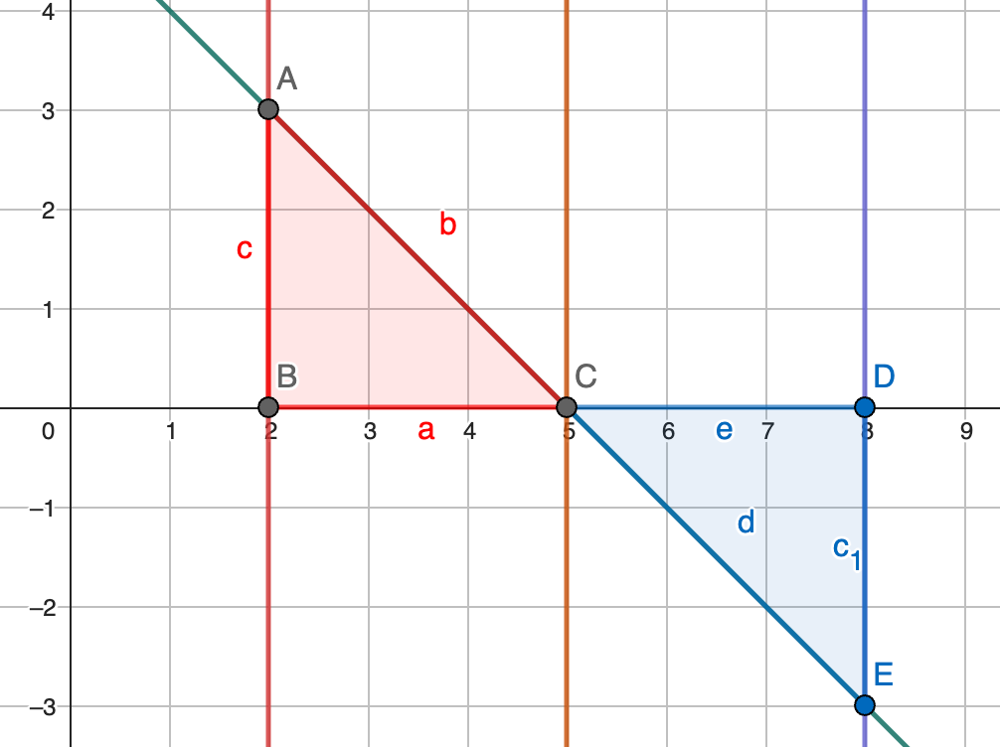
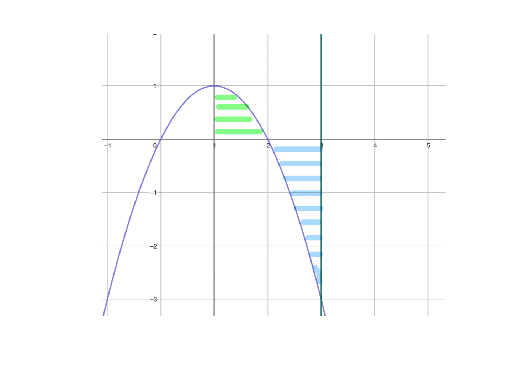

## Integralkalkylens fundamentalsats

[Wanmin Liu](https://wanminliu.github.io/matte/)

20251113

Ma3c

## Pass 1.

### Primitiva funktioner
Bestäm primitiva funktioner till 

$$f(x)=12-x^3$$ 

$$g(t)=16t-5e^{5t}$$ där $G(0)=10$.

**Svar.**
$$F(x)=12x-\frac{x^4}{4}+C.$$
$$G(t)=8t^2-e^{5t}+C.$$
$$G(0)=8\cdot 0^2-e^{5\cdot 0}+C=10$$
Dvs $$0-1+C=10.$$
Då blir $C=11$, och
$$G(t)=8t^2-e^{5t}+11.$$

### Integralkalkylens fundamentalsats
$$\int_{a}^{b}f(x)dx = F(x)|_{a}^{b}=F(b)-F(a).$$

Arean under kurvan $y=f(x)$ och x-axeln, mellan integrations gränserna $x=a$ och $x=b$.

Låt oss titta på ett exempel.

### Exempel 1. 
Använd figuren och beräkna
$$\int_{2}^{5}f(x)dx,$$
och
$$\int_{5}^{8}f(x)dx,$$
där $y=f(x)=-x+5$.

Beräkna
$$\int_{2}^{8}f(x)dx.$$

**Lösning**

_Metod 1._ 

$$\text{Arean av triangel } ABC =\frac{1}{2}AB\cdot BC=\frac{1}{2}\cdot 3\cdot 3=4,5.$$

$$\text{Arean av triangel } CDE =\frac{1}{2}CD\cdot DE=\frac{1}{2}\cdot 3\cdot 3=4,5.$$

_Metod 2._ Integralkalkylens fundamentalsats

$$F(x)=5x-\frac{x^2}{2}+C.$$

$$
\begin{align}
\int_{2}^{5}f(x)dx &= F(x)|_{2}^{5}\\
 &= F(5)-F(2)\\
 &= 5\cdot 5-\frac{5^2}{2}+C-(5\cdot 2-\frac{2^2}{2}+C) \\
&=  5\cdot 5-\frac{5^2}{2}-(2\cdot 5-\frac{2^2}{2})\\
&= 12,5-8\\
&= 4,5.
\end{align}
$$

$$
\begin{align}
\int_{5}^{8}f(x)dx &= F(x)|_{5}^{8}\\
 &= F(8)-F(5)\\
 &= 5\cdot 8-\frac{8^2}{2}-(5\cdot 5-\frac{5^2}{2}) \\
&=  8-12,5\\
&= -4,5.
\end{align}
$$

$$
\begin{align}
\int_{2}^{8}f(x)dx &= F(x)|_{2}^{8}\\
 &= F(8)-F(2)\\
 &= 5\cdot 8-\frac{8^2}{2}-(5\cdot 2-\frac{2^2}{2}) \\
&=  8-8\\
&= 0.
\end{align}
$$

Men arean av triangeln ABC och triangeln CDE total är $4,5+4,5=9$.

### Exempel 2. 
Johan vill beräkna arean mellan $f(x)=2x-x^2$ och x-axlen i interval $x=1$ till $x=3$.

**Lösning**
Vi hittar nollställen till $f(x)$.
$$2x-x^2=0$$
$$x(2-x)=0$$
$x_1=0$ och $x_2=2$.

$x_2=2$ är i interval $x=1$ till $x=3$.

Area blir
$$
\begin{align}
\mathrm{Arean} &= \int_{1}^{2}f(x)dx-\int_{2}^{3}f(x)dx\\
&= F(2)-F(1)-(F(3)-F(2))\\
&= 2F(2)-F(1)-F(3).
\end{align}
$$

Vi kan ta (dvs, vi tar $C=0$)
$$F(x)=x^2-\frac{x^3}{3}.$$

$$
\begin{align}
F(1) &= 1^2-\frac{1^3}{3}=\frac{2}{3}.\\
F(2) &= 2^2-\frac{2^3}{3}=4-\frac{8}{3}=\frac{4}{3}.\\
F(3) &= 3^2-\frac{3^3}{3}=9-9=0.
\end{align}
$$

Vi får
$$
\begin{align}
\mathrm{Arean} &= 2F(2)-F(1)-F(3).\\
 &= 2\cdot\frac{4}{3}-\frac{2}{3}-0\\
 &= 2.
\end{align}
$$
**Svar.** Arean är 2 a.e.

### Uppgift
S. 166-167, 02, 04, 07, 10.  
S. 171-172, 13, 14, 16, 18, 20, 21, (23), 24.

---

Pass 2

Exempel från [gamla NP](https://www.umu.se/institutionen-for-tillampad-utbildningsvetenskap/np/np-2-4/tidigare-givna-prov/).

[Ma3c-HT15](https://arkiv.edusci.umu.se/np/np-2-4-prov/Ma3c-ht15.pdf)

### (Ma3c-ht16 13b, (0/2/0)) 
$$\int_{-4}^{-2}\frac{4}{x^2}dx$$

GeoGebra

