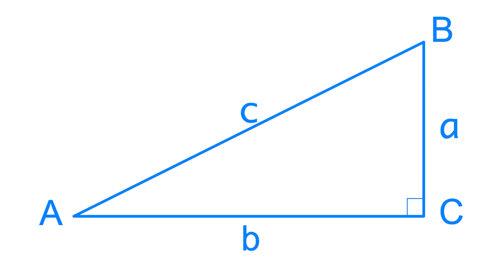
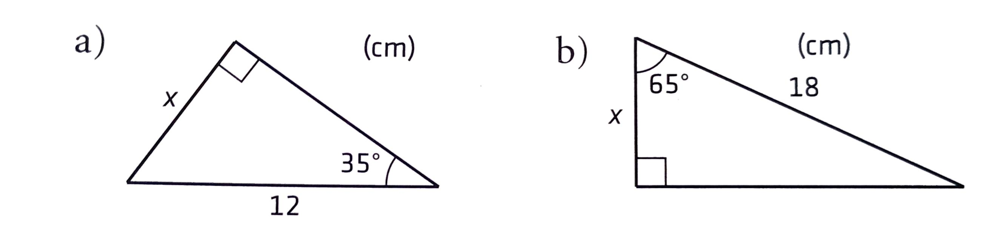
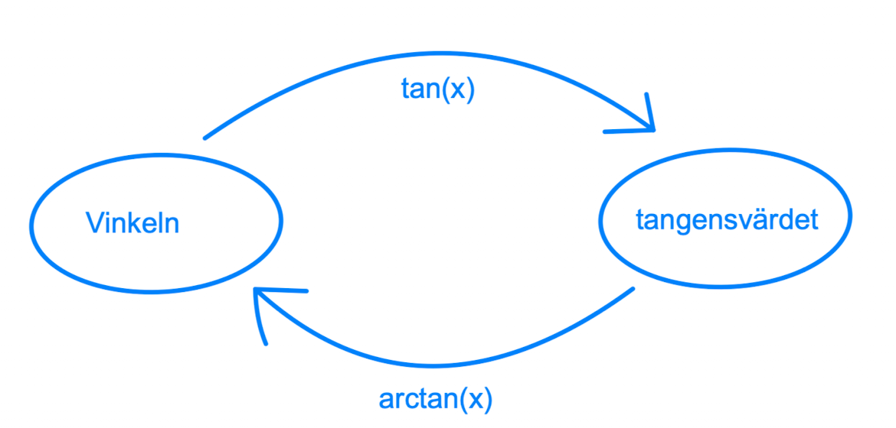
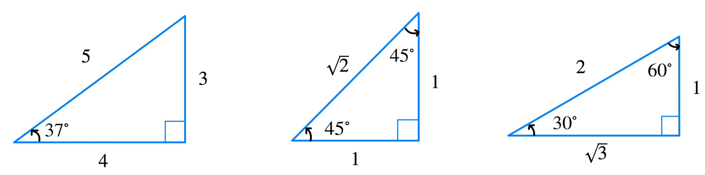
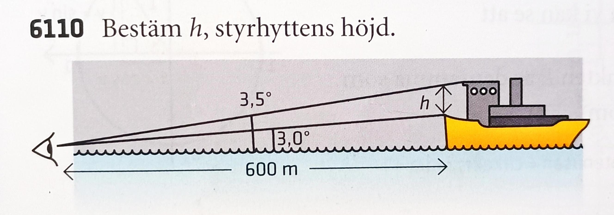
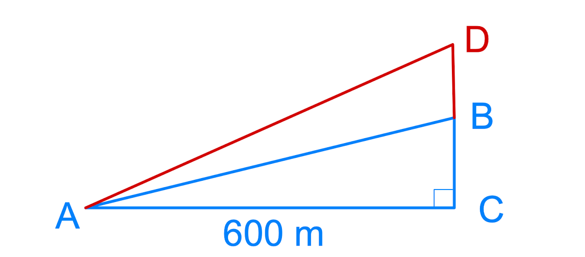
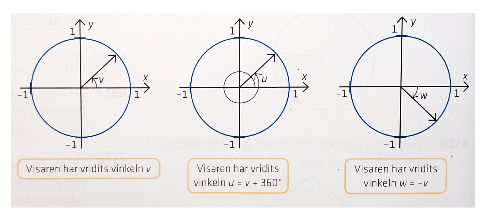

## Trigonometri I

[Wanmin Liu](https://wanminliu.github.io/matte/) 

---

Ma3c

Pass 1. 8.30 - 9.30.

* Förkunskapen i Ma1c.
  - Rätvinklig triangel
  - Pythagoras sats
  - sinus och cosinus funktioner i en rätvinklig triangel
  - Beräkna vinklar med tangens
* Uppgifter

Pass 2. 9.50 - 10.55

* Enhetscirkeln
* Allmänna positiva och negativa vinklar
* Definitioner av sinus-, cosinus- och tangentfunktioner
* Aktivitet i par: Beräkning av funktionsvärden för speciella vinklar.

---

Pass 1. 8.30 - 9.30.

### Förkunskapen i Ma1c.

I en rätvinklig triangel $ABC$, där $C$ är den räta vinkeln ($C = 90^\circ$), har vi relationer  
$$A+B=90^\circ,$$  
eftersom $A+B+C=180^\circ$, och Pythagoras sats  
$$c^2=a^2+b^2.$$

Vi definerar tre funktionerna:

{: style="width:40%"}

$$
\begin{align}
\sin A &= \frac{a}{c},\\
\cos A &= \frac{b}{c},\\
\tan A &= \frac{a}{b}.
\end{align}
$$

Kanten $a$ kallas **motstående katet** av vinkel $A$. Kanten $b$ kallas **närliggande katet** av vinkel $A$. Kanten $c$ kallas **hypotenusa**. 

Om vi tittar från vinkel $B$ har vi också  
$$
\begin{align}
\sin B &= \frac{b}{c} = \cos A,\\
\cos B &= \frac{a}{c}=\sin A,\\
\tan B &= \frac{b}{a}=\frac{1}{\tan A}.
\end{align}
$$

**Exempel 1.** **Trigonometriska ettan.**  
$$(\sin(A))^2+(\cos(A))^2=1^2 \implies \sin^2(A)+\cos^2(A)=1.$$

---

**Exempel 2.** Beräkna längden av sidorna markerade med $x$, med hjälp av de trigonometriska sambanden.

{: style="width:60%"}

(a) $\sin(35^\circ)=\frac{x}{12} \implies x=12 \cdot \sin(35^\circ) \approx 6.9$  

(b) $\cos(65^\circ)=\frac{x}{18} \implies x=18 \cdot \cos(65^\circ) \approx 7.6$  

---

### Beräkna vinklar med tangens

{: style="width:40%"}

**Exempel 3.** 3-4-5 triangeln, likbent $45^\circ$ och $30^\circ$ rätvinklig trianglar

{: style="width:70%"}

$$
\arctan\left(\frac{3}{4}\right) \approx 37^\circ, \quad \tan(37^\circ) \approx \frac{3}{4}.
$$

---

**Exempel 4.** Uppgift 6110.

{: style="width:40%"}

{: style="width:40%"}

$$
\begin{align}
\tan(CAB) &= \frac{BC}{600},\\
\tan(CAD) &= \frac{DC}{600},\\
h &= 600 \cdot \tan(3.5^\circ) - 600 \cdot \tan(3^\circ) \approx 5.3
\end{align}
$$

---

### Aktivitet: Interaktiv rätvinklig triangel

<iframe src="https://www.geogebra.org/material/iframe/id/pdc9zysf/width/800/height/500/border/888888/rc/false/ai/true" width="800" height="500" style="border:1px solid #888"></iframe>

> Dra i triangeln och se hur $\sin$, $\cos$, $\tan$ förändras i realtid.

---

Pass 2. 9.50 - 10.55

### Enhetscirkeln

{: style="width:70%"}

**Exempel:** $-90^\circ$ rotation är medurs runt origo.  

$$\text{Positiv vinkel} \Longleftrightarrow \text{moturs}, \quad \text{Negativ vinkel} \Longleftrightarrow \text{medurs}$$

---

### Aktivitet: Interaktiv enhetscirkel

<iframe src="https://www.geogebra.org/material/iframe/id/weacqrcb/width/800/height/500/border/888888/rc/false/ai/true" width="800" height="500" style="border:1px solid #888"></iframe>

> Välj en vinkel $v$ och se hur $(\cos v, \sin v)$ samt $\tan v$ uppdateras.

---

### Definitioner på enhetscirkeln

$$
x^2+y^2=1, \quad P=(\cos v, \sin v), \quad \tan v = \frac{\sin v}{\cos v}.
$$

**Trigonometriska ettan:**  
$$\sin^2 v + \cos^2 v = 1$$

---

### Egenskaper hos trigonometriska funktioner

**Periodicitet:**
$$
\sin(v) = \sin(v+360^\circ), \quad
\cos(v) = \cos(v+360^\circ), \quad
\tan(v) = \tan(v+180^\circ)
$$

---

### Aktivitet: Tangentlinjen vid $x=1$

<iframe src="https://www.geogebra.org/material/iframe/id/bx3w8rv6/width/800/height/500/border/888888/rc/false/ai/true" width="800" height="500" style="border:1px solid #888"></iframe>

> Flytta punkt $P$ på enhetscirkeln och observera linjen $OP$ samt skärningspunkten med $x=1$.

---

### Sammanfattning

* Punkten $P$ i enhetscirkeln: $P=(\cos v, \sin v)$  
* Lutning: $\tan v$  
* Trigonometriska ettan: $\sin^2 v + \cos^2 v = 1$  
* Positiv vinkel $\Longleftrightarrow$ moturs, negativ vinkel $\Longleftrightarrow$ medurs.