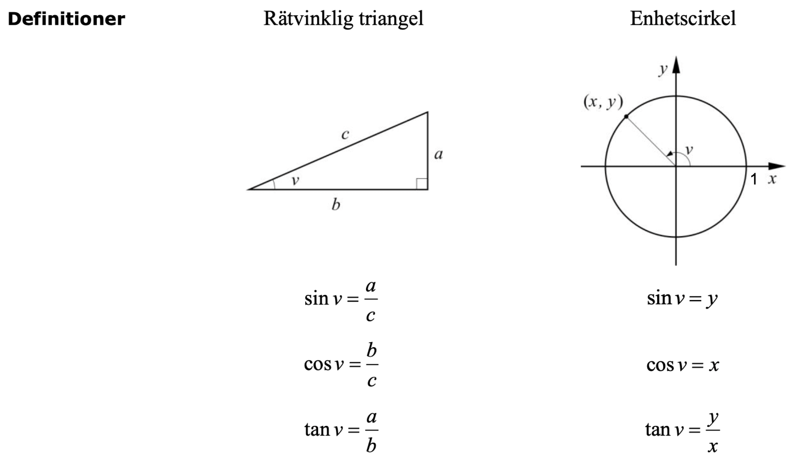
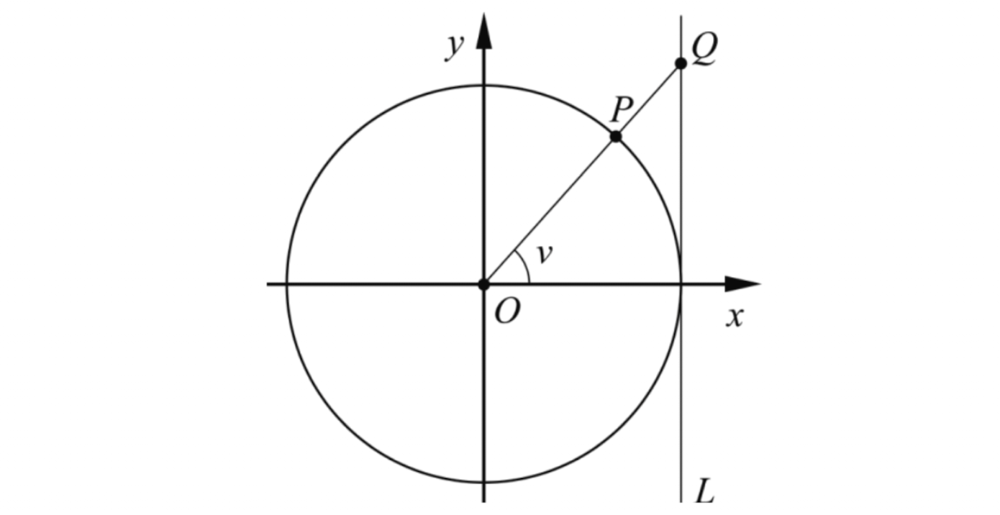
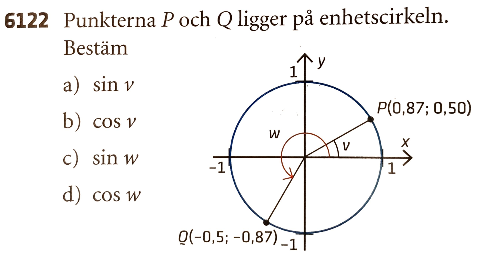
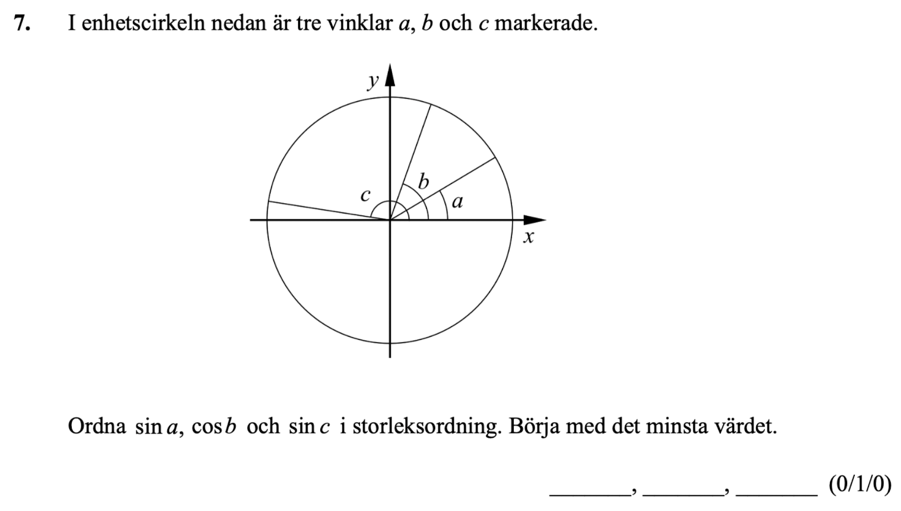

## Trigonometri I

[Wanmin Liu](https://wanminliu.github.io/matte/) 

---

Ma3c

Pass 1. 8.30 - 9.30.

* Förkunskapen i Ma1c.
  - Rätvinklig triangel
  - Pythagoras sats
  - sinus och cosinus funktioner i en rätvinklig triangel
  - Beräkna vinklar med tangens
* Uppgifter

Pass 2. 9.50 - 10.55

* Enhetscirkeln
* Allmänna positiva och negativa vinklar
* Definitioner av sinus-, cosinus- och tangentfunktioner
* Aktivitet i par: Beräkning av funktionsvärden för speciella vinklar.

---

Pass 1. 8.30 - 9.30.

### Förkunskapen i Ma1c.

I en rätvinklig triangel ABC, där C är den räta vinkeln ($ C = 90^{\circ} $), har vi relationer
$$A+B=90^{\circ},$$
eftersom $A+B+C=180^\circ$, och Pythagoras sats
$$c^2=a^2+b^2.$$

Vi definerar tre funktionerna:

$$
\begin{align}
\sin A &= \frac{a}{c},\\
\cos A &= \frac{b}{c},\\
\tan A &= \frac{a}{b}.
\end{align}
$$

Kanten $a$ kallas **motstående katet** av vinkel A. Kanten $b$ kallas **närliggande katet** av vinkel A. Kanten $c$ kallas **hypotenusa**. 

Om vi ​​tittar från vinkel B har vi också
$$
\begin{align}
\sin B &= \frac{b}{c} = \cos A,\\
\cos B &= \frac{a}{c}=\sin A,\\
\tan B &= \frac{b}{a}=\frac{1}{\tan A}.
\end{align}
$$

**Exempel 1.** **Trigonometriska ettan.** Använd **Pythagoras sats** för att visa att
$$(\sin(A))^2+(\cos(A))^2=1^2.$$
Detta samband kan vi förenklat skriva som
$$\sin^2(A)+\cos^2(A)=1,$$
där $\sin^2(A)$ betyder $(\sin(A))^2=\sin(A)\cdot \sin(A)$.

I en allmän triangel ABC har vi alltid  $0<A<180^\circ$.

**Motivationsfrågor.**

1. Hur kan vi generera begreppet vinkel, till exempel $720^\circ$ eller $-45^\circ$?

2. Hur kan vi generalisera de tre funktionerna för mer generella vinklar?

3. Kan vi uttrycka vinklar på andra sätt? Vinklar på grader och _radianer_ (_Matematik 4_).

**Exempel 2.** Beräkna längden av sidorna markerade med $x$, med hjälp av de trigonometriska sambanden.

**Lösning**
(a) Med definition av sinus funktion har vi
$$\sin(35^\circ)=\frac{x}{12}.$$
Så $x=12\cdot \sin(35^\circ)\approx 6,9$.

**Svar:** Den sökta sidan är ungefär 6,9 cm.

(b) Med definition av cosinus funktion har vi
$$\cos(65^\circ)=\frac{x}{18}.$$
Så $x=18\cdot \cos(65^\circ)\approx 7,6$.

**Svar:** Den sökta sidan är ungefär 7,6 cm.

**Tips:** På miniräknare väljer vi **Degree** symbolen (inte  RAD) till vinkeln.

### Beräkna vinklar med tangens

Använder vi funktionsbegreppet så är $y=\arctan(x)$ en **invers funktion** till $y=\tan(x)$ och tvärtom.

**Exempel 3.** 3-4-5-triangeln, likbent rätvinklig triangel ($45^\circ$) och $30^\circ$-rätvinklig triangel.

$$
\begin{align}
\arctan(\frac{3}{4}) &\approx 36.8698976^\circ\approx 37^\circ,\\
\tan(37^\circ) & \approx 0.753554 \approx \frac{3}{4}.
\end{align}
$$

**Exempel 4.** Uppgift 6110. 

Ger en ledtråd med bilden.

**Lösning**
Vi ritar bilden med punkterna A, B, C, D. Vinkeln CAB är $3^\circ$. Vinkeln CAD är $3,5^\circ$. Höjden $h$ är längden på BD.

Vi har
$$
\begin{align}
\tan(CAB) &= \frac{BC}{AC}=\frac{BC}{600},\\
\tan(CAD) &= \frac{DC}{AC}=\frac{DC}{600}.
\end{align}
$$

Så är $BC=600\tan(3^\circ)$, och $DC=600\tan(3,5^\circ)$.

$$h=DC-BC=600\cdot\tan(3,5^\circ)-600\cdot\tan(3^\circ)\approx 36,7 - 31,4=5,3.$$

**Svar:** Höjden är 5,3 meter.

---

**Uppgifter i boken.**
Tips på miniräknare: Välj vinklar **Degree**, _inte Radianer_.

**s 194-195.** Nivå 1. 6101 (b), 6102 (b), 6103, 6104. Nivå 2. 6109, 6110, 6116.

---

Pass 2. 9.50 - 10.55

### Enhetscirkeln

En enhetscirkel är en cirkel med radie 1 och centrum i origo.

En vinkel (med positivt/plus tecken) innebär en vridning **moturs** runt origo från den positiva x-axeln.

En vinkel med negativt/minus tecken innebär en vridning **medurs** runt origo från den positiva x-axeln.

Till exempel representerar $-90^{\circ}$ en rotation på $90^{\circ}$ **medurs** runt origo från den positiva x-axeln.

$$\text{Positiv vinkel} \Longleftrightarrow \text{moturs} \qquad \quad \text{Negativ vinkel} \Longleftrightarrow \text{medurs}  $$

**Exempel 1.** Varje morgon när jag lämnar mitt barn i skolan säger jag:
"Jag ska krama dig och snurra dig tre varv."
Men egentligen snurrar jag honom fyra varv moturs (åt vänster) och ett varv medurs (åt höger). Hur många grader snurrade jag mitt barn totalt?

**Svar:** Ett varv är 360 grader. Det är totalt
$$360^\circ \cdot (4-1)=360^\circ\cdot 3 = 1080^\circ.$$

### Definition av sinus, cosinus och tangens

Vinkeln $v$ bestämmer en punkt $P(x,y)$ på enhetscirkeln. Vi har Pythagoras sats
$$x^2+y^2=1.$$
Definiera att
$$\sin v = y\text{-koordinaten för punkt } P,$$
$$\cos v = x\text{-koordinaten för punkt } P,$$ 
och
$$\tan v = \frac{\sin v}{\cos v} \quad\text{ om } \cos v\neq 0.$$

Dvs punkten $P$ har koordinater 
$$(\cos v, \ \sin v),$$ 
och det finns **trigonometriska ettan** för vilken vinkel $v$ som helst
$$\sin^2 v + \cos^2 v =1,
$$
där $\sin^2 v$ betyder $(\sin v)^2=\sin v \cdot \sin v$ och $\cos^2 v$ betyder $(\cos v)^2=\cos v \cdot \cos v$. 

---

**Exempel 2.** (Också i Enhetscirkeln blad.)

$$\cos 0^\circ =1, \quad \cos 60^\circ =\frac{1}{2}, \quad \cos 90^{\circ}=0.$$
$$\sin 0^\circ =0, \quad \sin 60^\circ =\frac{\sqrt{3}}{2}, \quad \sin 90^{\circ}=1.$$

Vad är $\tan 0^\circ$? Vad är $\tan 60^\circ$? Vad är $\tan 90^\circ$?

---

**Exempel 3.** Punkten $P(\cos v, \sin v)$ ligger på enhetscirkeln.   

* F1. Skriv ner linjeekvationen för $OP$. 
* F2. Linjen $OP$ skär linjen $x=1$ i punkten $Q$. Beräkna koordinaterna för punkten $Q$.

---

**Lösning.**
Lutningen för $OP$ ges av formeln 
$$
k=\frac{y_2-y_1}{x_2-x_1}=\frac{\sin v-0}{\cos v-0}=\tan v.
$$

**Lutningen för linjen** $OP$ **är exakt** $\tan v$.

Linjen $OP$ har k-värdet $\tan v$ och m-värdet 0. Så linjens ekvation ges av $$y=(\tan v) \cdot x.$$

Punkten $T$ har x-koordinat 1. Punkten $Q$ ligger också på linjen $OP$, så dess koordinater uppfyller linjens ekvation. Vi sätter in $x=1$ i linjens ekvation för $OP$ och får $y=(\tan v)\cdot 1=\tan v$.

**Svar:** Linjen $OP$ har ekvation $$y=(\tan v) \cdot x.$$
Punkten $Q$ har koordinaterna $(0, \tan v)$. 

Det är två **geometriska förklaringar** till tangenten:

1. Lutningen på linjen $OP$.
2. y-koordinaten för skärningspunkten $Q$, dvs. skärningspunkten mellan $OP$ och cirkelns _tangent_ linje vid $x=1$.

### Egenskaper hos trigonometriska funktioner

**Periodicitet.**

$$
\begin{align}
\sin(v) &= \sin(v+360^\circ),\\
\cos(v) &= \cos(v+360^\circ),\\
\tan(v) &= \tan(v+180^\circ).
\end{align}
$$

Nästa gång går vi igenom fler egenskaper hos trigonometriska funktioner

---

**Exempel 4. (6122)** 

$\frac{\sqrt{3}}{2}\approx 0,87$. $0,5^2+0,87^2 = 1.0069\approx 1$

---

**Exempel 5.** (Ma3c-NP-ht-13, (0/1/0))

---

**Exempel 6.** Innan aktiviteten tittar vi tillsammans på enhetscirkeln i GeoGebra.

[Enhetscirkeln. Exakta värden för grader och radianer](https://www.geogebra.org/m/WeAcQrCB)

---

### Aktivitet i par

Fyll i följande tabell med hjälp av enhetscirkeln.

* Tips 1. En rak linje representerar $180^\circ$. En rät linje $y=kx$ skär en cirkel i två par punkter $(x,y)\Longleftrightarrow (-x, -y)$.

I enhetscirkeln låter vi punkten $P$ motsvara vinkeln $v$ och punkten $Q$ motsvara vinkeln $w$. 

* Tips 2.  Om $v+w=180^\circ$, så har punkt $P$ och punkt $Q$ samma y-koordinat, dvs $$\sin(v)=\sin(w)=\sin(180^\circ-v).$$

* Tips 3. Om $v+w=0^\circ$, så har punkterna $P$ och $Q$ samma x-koordinat men motsatta y-koordinater, dvs
$$\cos(-v)=\cos(w)=\cos(v),$$
$$\sin(-v)=\sin(w)=-\sin(v).$$

* Tips 4. Vi kan tänka oss ett $30^\circ$ hopp, då har vi $A$ till $B$ till $D$. Vi kan tänka oss ett $45^\circ$ hopp, då har vi $A$ till $C$ till $E$.

---

### Sammanfattning.
* Punkten $P$ i enhetscirkeln har koordinaten $(x = \cos v, y = \sin v)$, där vinkeln $v$ är vinkeln mellan x-axeln och linjen $OP$.
* $\tan v = \frac{\sin v}{\cos v}$ är **lutningen** för $OP$.
* **Trigonometriska ettan**  $(\sin(A))^2+(\cos(A))^2=1$. (Pythagoras sats)
* $\text{Positiv vinkel} \Longleftrightarrow \text{moturs}, \quad \text{Negativ vinkel} \Longleftrightarrow \text{medurs}.  $

