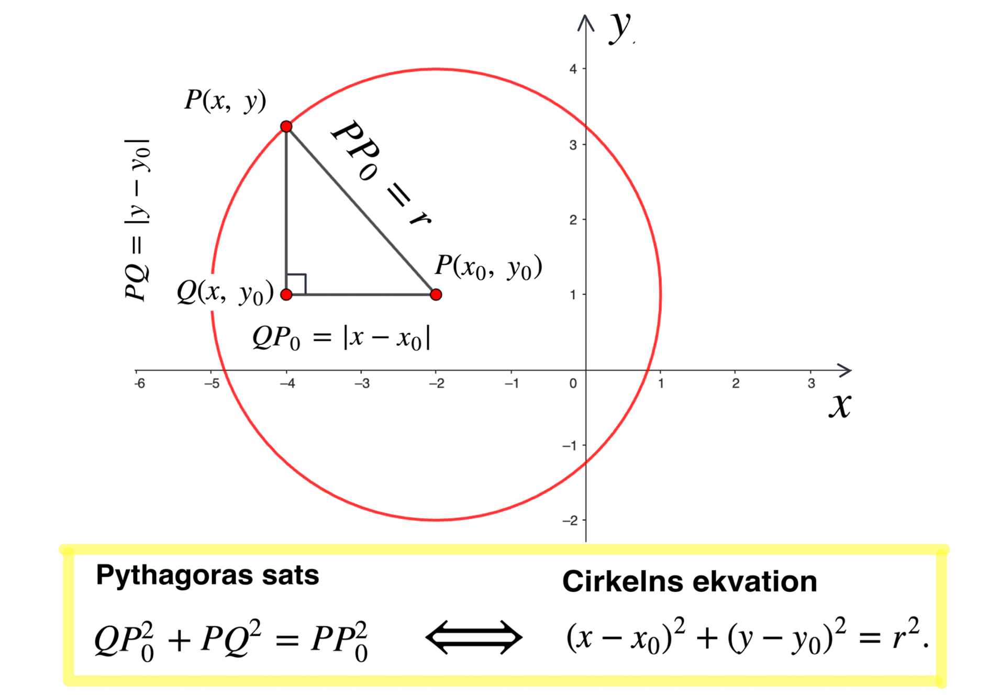
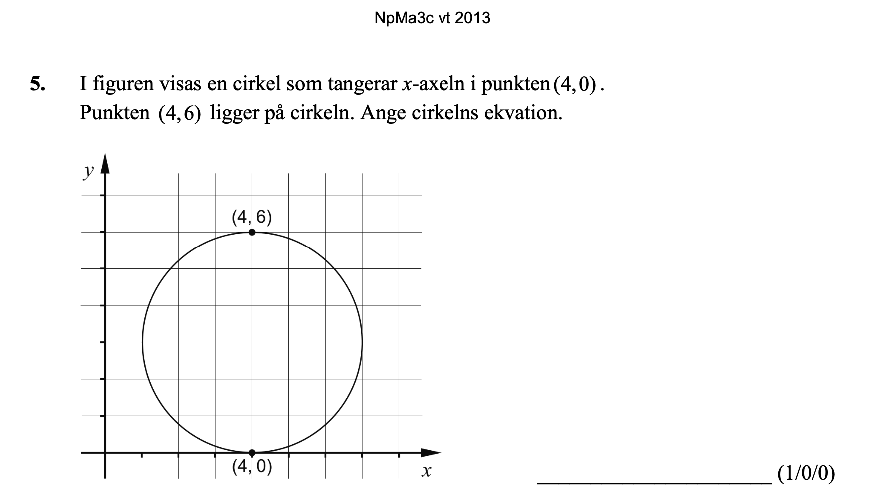

## Trigonometri II

[Wanmin Liu](https://wanminliu.github.io/matte/)

---

Ma3c

* Repetition.
  - Enhetscirkeln
  - Definitioner av sinus-, cosinus- och tangentfunktioner
  - Trigonometriska ettan. 
* Cirkelns ekvation

---

### Repetition.

En enhetscirkel är en cirkel med radie 1 och centrum i origo $O$.

Punkt P på cirkeln har koordinaten $(x=\cos v,\ y=\sin v)$, där $v$ är vinkeln från den positiva x-axeln till linjen $OP$.

$$\text{Positiv vinkel} \Longleftrightarrow \text{moturs} \qquad \quad \text{Negativ vinkel} \Longleftrightarrow \text{medurs}$$ 

**Exempel.** **Trigonometriska ettan.** 
$$\sin^2(A)+\cos^2(A)=1,$$
där $\sin^2(A)$ betyder $(\sin(A))^2=\sin(A)\cdot \sin(A)$.

### Cirkelns ekvation

Enhetscirkel har ekvationen $$x^2+y^2=1,$$ det vill säga, för varje punkt $P(x,y)$ på cirkeln uppfyller dess koordinater ekvationen $x^2+y^2=1$.

**Fråga:** Vad är ekvationen för en cirkel med radie $r$ och medelpunkten $P_0$ med koordinater $(x_0,y_0)$?

Om vi ​​betecknar punkten $P$ på cirkeln med koordinaterna $(x,y)$, då är avståndet $PP_0=r$.

Beteckna $Q$ med koordinaterna $(x, \ y_0)$. Då är $PQP_0$ en rätvinklig triangel. Vi kan använda Pythagras sats.
$$QP_0^2+PQ^2=PP_0^2,$$
där $QP_0=|x-x_0|$, $PQ=|y-y_0|$ och $PP_0=r$.

En cirkel med radien $r$  och medelpunkten i $(x_0,y_0)$ beskrivs av ekvationen
$$
(x-x_0)^2+(y-y_0)^2=r^2.
$$

**Exempel.** (NpMa3c vt 2015, n.11, (2/0/0))  
En cirkel har ekvationen $(x-3)^2+(y-2)^2=64$. Undersök om punkten $(10, \ 6)$ ligger på cirkeln. 

**Lösning.** Vi sätter in $(10, \ 6)$ i ekvationen.
$$\mathrm{VL}=(10-3)^2+(6-2)^2=49+16=65\neq \mathrm{HL}.$$
**Svar:** Punkten med koordinaterna $(10, \ 6)$ ligger _inte_ på cirkeln. 

**Exempel.** (Ma3c-vt13-5, (1/0/0))

**Lösning**
Cirkeln med radie $3$ och medelpunkten $(4,3)$. Cirkelns ekvationen är
$$
(x-4)^2+(y-3)^2=3^2.
$$
 
### Cirklarnas ekvation i icke-standardform.
Om cirkelns ekvation inte är i standardformen ovan måste vi använda formlerna 
$$(a+b)^2=a^2+2ab+b^2, \quad (a-b)^2=a^2-2ab+b^2,$$
för att komplettera kvadraten och skriva om ekvationerna till standardform.

**Exempel** (6153 c.) Bestäm medelpunkt och radie för den cirkel 
$$x^2-4x+y^2+6y+4=0.$$

**Lösning.** Vi observerar att $x^2-4x=x^2-2\cdot 2\cdot x$. För att komplettera kvadratformeln för $x^2 - 4x$ måste vi addera $2^2$ på båda sidor av ekvationen.

Samma idé för uttrycket $y^2+6y=y^2+2\cdot 3\cdot y$. För att komplettera kvadraten måste vi addera $3^2$ på båda sidor av ekvationen.

$$
\begin{align}
x^2-4x+y^2+6y+4 & = 0,\\
x^2-2\cdot 2\cdot x+2^2+y^2+2\cdot 3\cdot y+3^2+4 & = 2^2+3^3.\\
(x-2)^2+(y+3)^2+4 & =2^2+3^2.\\
(x-2)^2+(y-(-3))^2& =3^2.\\
\end{align}
$$

**Svar:** Medelpunkten är $(2,\ -3)$ och radien är $3$.

---
### Sammanfatting av trigonometrisk funktioner

1. **trigonometriska ettan.**
$$\sin^2 v + \cos^2 v =1.
$$

2. **Periodicitet.** 
$$
\begin{align}
\sin(v) &= \sin(v+360^\circ),\\
\cos(v) &= \cos(v+360^\circ),\\
\tan(v) &= \tan(v+180^\circ).
\end{align}
$$ 
 
3. **Symmetri.** Punkten $P$ i enhetscirkeln med koordinater $(x,y)=(\cos(v), \sin(v))$.  
  * Symmetripunkten med y-axeln är $(-x,y)=(-\cos(v), \sin(v))$.
$$
\begin{align}
\cos(180^\circ-v)&=-\cos(v),\\
\sin(180^\circ-v)&=\sin(v).
\end{align}
$$
 * Symmetripunkten med x-axeln är $(x,-y)=(\cos(v), -\sin(v))$. $$
\begin{align}
\cos(-v)&=\cos(v),\\
\sin(-v)&=-\sin(v).
\end{align}
$$

4. $\tan v = \frac{\sin v}{\cos v}$ är **lutningen** för $OP$, där $O$ är origo.

5. En cirkel med radien $r$  och medelpunkten i $(x_0,y_0)$ beskrivs av ekvationen
$$
(x-x_0)^2+(y-y_0)^2=r^2.
$$

