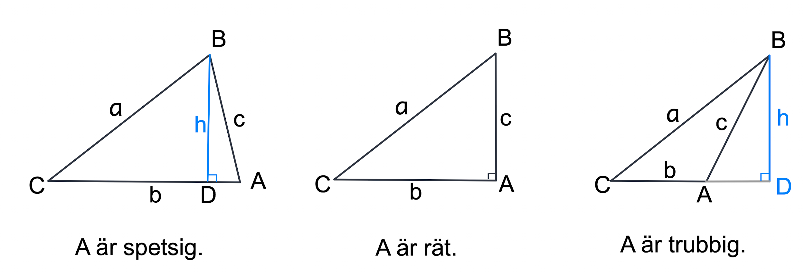
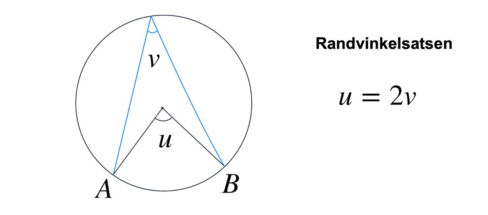
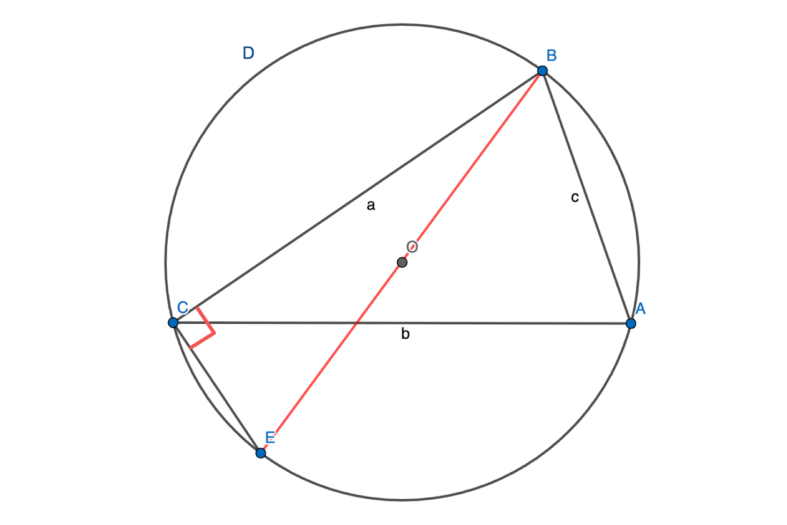
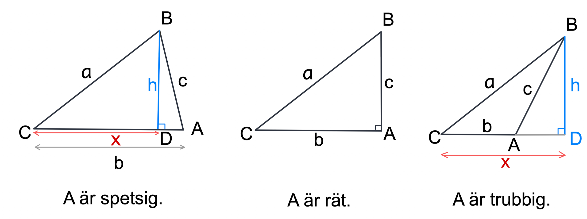
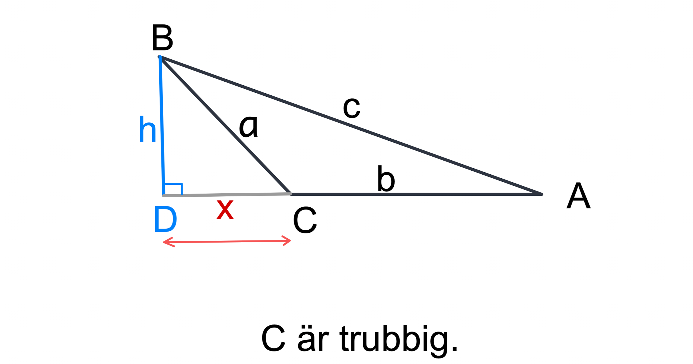
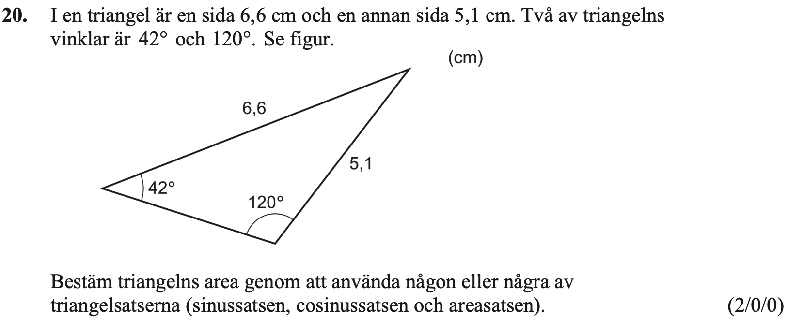
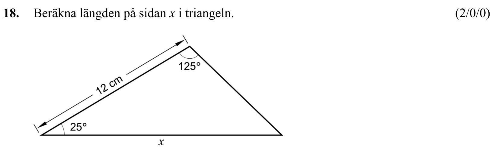
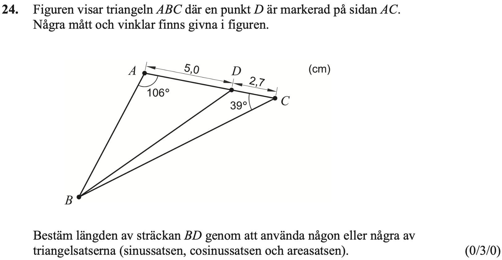
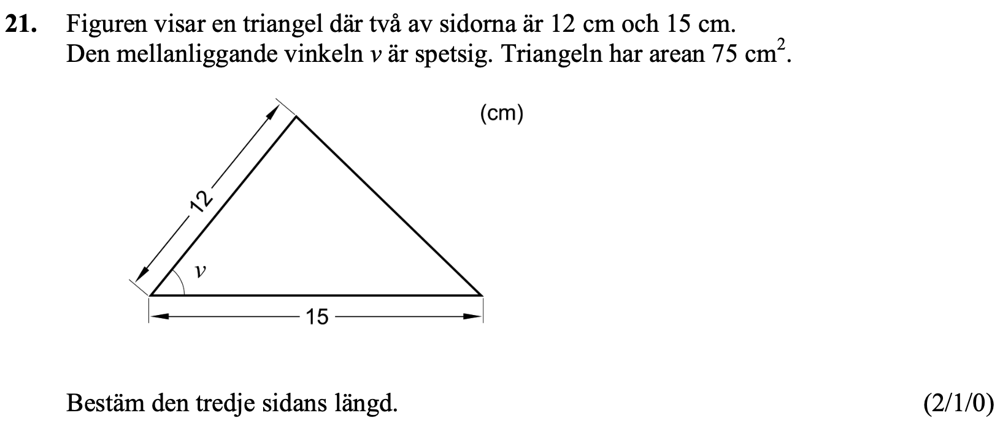

## Trigonometri III, triangelsatserna

[Wanmin Liu](https://wanminliu.github.io/matte/)

---

Ma3c

* Areasatsen
* Sinussatsen
* Cosinussatsen

_Beviset i boken är inte fullständigt. Ni är välkomna att läsa igenom det själva. Jag kommer inte att gå igenom alla bevis under lektionstid._

---

**Natation.** Vi betecknar alltid triangeln $ABC$ med vinklarna $A$, $B$ och $C$ och den motstående sidorna med längderna $a$, $b$, $c$. Så vi har relationen
$$A+B+C=180^\circ.$$
Vi har också 
$0<A<180^\circ$, $0<B<180^\circ$, $0<A<180^\circ$ och $a,b,c$ är positiva.

### Areasatsen

Vi kan beräkna triangelns area med formeln
$$\mathrm{Area}=\frac{\mathrm{basen}\cdot\mathrm{höjden}}{2}
$$

Med natationen ovan har vi arean av triangeln $ABC$ med följande formler:
$$\mathrm{Area}=\frac{b\cdot c\cdot\sin A}{2}=\frac{c\cdot a\cdot \sin B}{2}=\frac{a\cdot b\cdot \sin C}{2}.$$

#### Bevis

* Fall 1. $A$ är en spetsig vinkel. Höjden $h=c\sin A$ och  $\mathrm{basen}=b$. $$\mathrm{Area}=\frac{\mathrm{basen}\cdot\mathrm{höjden}}{2}=\frac{b\cdot c\cdot\sin A}{2}.
$$ 
* Fall 2. $A$ är en rät vinkel så $\sin A=1$. $\mathrm{Höjden}=c$ och  $\mathrm{basen}=b$. $$\mathrm{Area}=\frac{\mathrm{basen}\cdot\mathrm{höjden}}{2}=\frac{b\cdot c\cdot\sin A}{2}.$$ 
* Fall 3. $A$ är en trubbig vinkel. Då blir vinkel $BAD=180^\circ-A$. Vinklen $BAD$ är spetsig. Vi vet att $\sin(180^\circ-A)=\sin A$. $\mathrm{Höjden}=c\sin(BAD)=c\sin(180^\circ-A)=c\sin(A)$ och $\mathrm{basen}=b$. $$\mathrm{Area}=\frac{\mathrm{basen}\cdot\mathrm{höjden}}{2}=\frac{b\cdot c\cdot\sin A}{2}.$$

Därför har vi alltid
$$\mathrm{Area}=\frac{b\cdot c\cdot\sin A}{2}.$$
På samma sätt kan vi bevisa de andra två ekvationerna.

Detta är slutet på beviset.

### Sinussatsen
Med natationen ovan har vi följande formler i triangeln $ABC$: 
$$\frac{\sin A}{a}=\frac{\sin B}{b}=\frac{\sin C}{c},$$
och
$$\frac{a}{\sin A}=\frac{b}{\sin B}=\frac{c}{\sin C}.$$

#### Bevis
**Metod 1.** (Använd areasatsen.) Vi använder areasatsen direkt.
$$\mathrm{Area}=\frac{b\cdot c\cdot\sin A}{2}=\frac{c\cdot a\cdot \sin B}{2}=\frac{a\cdot b\cdot \sin C}{2}.$$
Observera att ingen av de tre sidlängderna kan vara $0$. Därför är $abc$ inte $0$. Vi dividerar sedan $abc$ för ovanstående ekvation och multiplicerar med 2.
Vi får
$$\frac{b\cdot c\cdot\sin A}{abc}=\frac{c\cdot a\cdot \sin B}{abc}=\frac{a\cdot b\cdot \sin C}{abc},$$
dvs
$$\frac{\sin A}{a}=\frac{\sin B}{b}=\frac{\sin C}{c}.$$

Observera att $\sin(A)$, $\sin(B)$ och $\sin(C)$ inte alla är noll, så vi kan skriva om proportionen ovan. Vi får
$$\frac{a}{\sin A}=\frac{b}{\sin B}=\frac{c}{\sin C}.$$

Detta är slutet på beviset.

Innan vi ger det andra beviset måste vi komma ihåg 

**Randvinkelsatsen:** Medelpunktsvinkeln $u$ till cirkelbågen $AB$ är dubbelt så stor som randvinkeln $v$ som står på samma cirkelbåge $AB$, alltså att $u=2v$.

**Metod 2.** (Använd randvinkelsatsen)
För triangeln $ABC$ ritar vi dess omskrivna cirkel, vilket betyder att punkterna $A$, $B$ och $C$ ligger på en cirkel med radien $R$. Linjen som går genom punkt $B$ och cirkelns centrum $O$ skär cirkeln i en punkt, betecknad som punkt $E$. 

Vi använder en följdsats från **randvinkelsatsen**:
**En randvinkel på en halvcirkelbåge är alltid $90^\circ$.**

$BE$ är diametern, därför är vinkeln $ECB$ en rät vinkel. I den rätvinkliga triangeln $ECB$ har vi 
$$\sin(CEB)=\frac{CB}{BE}=\frac{a}{2R}. \qquad (1)
$$

Vi använder andra följdsats från **randvinkelsatsen**:
**Alla randvinklar på samma cirkelbåge är lika stora.**

För cirkelbåge $CDB$ är randvinklar $CAB=CEB$. Då blir 
$$\sin(A)=\sin(CAB)=\sin(CEB) \qquad (2).$$

Med hjälp av formlerna (1) och (2) får vi $\frac{a}{\sin(A)}=2R$.
På liknande sätt får vi $\frac{b}{\sin(B)}=2R$ och $\frac{c}{\sin(C)}=2R$.
Således har vi bevisat
$$\frac{a}{\sin(A)}=\frac{b}{\sin(B)}=\frac{c}{\sin(C)}=2R,
$$
och
$$\frac{\sin A}{a}=\frac{\sin B}{b}=\frac{\sin C}{c}=\frac{1}{2R}.$$
Detta är slutet på beviset.

### Cosinussatsen
Med natationen ovan har vi följande formler i triangeln $ABC$:
$$c^2=a^2+b^2-2ab\cdot \cos C,$$
$$b^2=c^2+a^2-2ca\cdot \cos B,$$
$$a^2=b^2+c^2-2bc\cdot \cos A.$$

#### Bevis

Vi fokuserar på vinkeln $C$ och bevisar att 
$$c^2=a^2+b^2-2ab\cdot \cos C.$$

* Fall 1. $C$ är en spetsig vinkel.  
  * Delfall 1.1.  $A$ är en spetsig vinkel. Pythagoras sats i den vänstra triangeln $CDB$ ger $h^2+x^2=a^2$. Pythagoras sats i den högra triangeln $BDA$ ger $h^2+(b-x)^2=c^2$. Dessa två uttryck för $h$ sätts lika. Vi vet att $\cos C=\frac{x}{a}$. Vi får 
$$
\begin{align}
c^2 &= h^2+(b-x)^2\\
 &= h^2+b^2-2bx+x^2\\
  &= h^2+b^2-2ab\cdot\frac{x}{a}+x^2\\
 &= a^2+b^2-2ab\cos(C).
\end{align}
$$
  * Delfall 1.2.  $A$ är en rät vinkel. Vi vet $a\cos C=b$ och $c^2 = a^2-b^2$.
$$
\begin{align}
a^2+b^2-2ab\cos(C) &= a^2+b^2-2b(a\cos C)\\
 &= a^2+b^2-2b\cdot b=a^2+b^2-2b^2\\
  &= a^2+b^2-2b^2\\
   &= c^2.\\
\end{align}
$$
  * Delfall 1.3.  $A$ är en trubbig vinkel. Pythagoras sats i den triangeln $CDB$ ger $h^2+x^2=a^2$. Pythagoras sats i den triangeln $BDA$ ger $h^2+(x-b)^2=c^2$. Dessa två uttryck för $h$ sätts lika. Vi vet att $\cos C=\frac{x}{a}$. Vi får 
$$
\begin{align}
c^2 &= h^2+(x-b)^2\\
 &= h^2+b^2-2xb+x^2\\
 &= h^2+b^2-2ab\cdot\frac{x}{a}+x^2\\
 &= a^2+b^2-2ab\cos(C).
\end{align}
$$

* Fall 2. $C$ är en rät vinkel. Vi har $\cos C = 0$. Pythagoras sats ger $c^2=a^2+b^2=a^2+b^2-2ab\cos C.$ 
* Fall 3. $C$ är en trubbig vinkel.

Vi vet att $\cos C<0$ och $\cos DCB=\cos(180^\circ-C)=-\cos C>0$.
Pythagoras sats i den triangeln $CDB$ ger $h^2+x^2=a^2$. Pythagoras sats i den triangeln $BDA$ ger $h^2+(x+b)^2=c^2$. Dessa två uttryck för $h$ sätts lika. Vi vet att $-\cos C=\cos DCB=\frac{x}{a}$. Vi får 
$$
\begin{align}
c^2 &= h^2+(b+x)^2\\
 &= h^2+b^2+2bx+x^2\\
 &= a^2+b^2+2ab\cdot\frac{x}{a}\\
  &= a^2+b^2-2ab\cos(C).
\end{align}
$$
Så har vi bevisat
$$c^2=a^2+b^2-2ab\cdot \cos C.$$
De andra två formlerna följer på samma sätt. Detta är slutet på beviset.

---

**Exempel 1.** (Ma3c-vt22-20, (2/0/0))

**Lösning.**
Den tredje vinkeln är $180^\circ-120^\circ-42^\circ=18^\circ$.
Vi använder areasatsen
$$\mathrm{Area}=\frac{1}{2}\cdot 6,6 \cdot 5,1 \cdot \sin(18^\circ)\approx 5,2.$$
**Svar:** Arean är cirka 5,2 $\mathrm{cm}^2$.

---

**Exempel 2.** (Ma3c-vt16-18, (2/0/0))

**Lösning.**
Den tredje vinkeln är $180^\circ-125^\circ-25^\circ=30^\circ$.
Vi använder sinussatsen
$$\frac{x}{\sin(125^\circ)}=\frac{12}{\sin(30^\circ)}.$$
$$x=\frac{12}{\sin(30^\circ)}\cdot\sin(125^\circ)\approx 19,66.$$
**Svar:** Längden på $x$ är cirka 19,66 cm.

---

**Exempel 3.** (Ma3c-vt22-24, (0/3/0))

**Lösning.** 
Vinklen $ABC$ är $180^\circ-106^\circ-39^\circ=35^\circ$.

Vi använder sinussatsen till triangeln $ABC$ och får
$$\frac{AB}{\sin(ACB)}=\frac{AC}{\sin(ABC)},$$
dvs
$$\frac{AB}{\sin(39^\circ)}=\frac{5,0+2,7}{\sin(35^\circ)}.$$
Vi får $AB=\frac{5,0+2,7}{\sin(35^\circ)}\cdot \sin(39^\circ) \approx 8,499.$

Vi använder cosinussatsen till triangeln $ABD$ och får
$$
\begin{align}
BD^2 &= AB^2+AD^2-2\cdot AB\cdot AD\cos(106^\circ)\\
 &= (8,499)^2+5^2-2\cdot 8,499\cdot 5\cos(106^\circ)\\
 &\approx 119,564.
\end{align}
$$
och $$BD\approx \sqrt{119,564}\approx 10.93.$$
**Svar:** Längden på $BD$ är cirka 11 cm.

---

**Exempel 4.** (Ma3c-vt17-21, (2/1/0))

**Lösning.**

Vi använder areasatsen till triangeln och får
$$75=\frac{1}{2}\cdot 12\cdot 15\sin(v),$$
dvs
$$\sin(v)=\frac{5}{6}.$$

Vi använder trigonometriska ettan och får
$$\sin^2(v) + \cos^2(v) =1,
$$
dvs
$$\big(\frac{5}{6}\big)^2+ \cos^2(v) =1.
$$
Då får vi
$$\cos^2(v)=\frac{11}{36}.
$$
Eftersom vinkeln v är spetsig, har vi $\cos(v)>0$. Så vi får $\cos(v)=\frac{\sqrt{11}}{6}$.

Beteckna längden motsatt vinkeln $v$ med $x$. Så $x>0$. Vi använder cosinussatsen till triangeln och får
$$
\begin{align}
x^2 &= 12^2+15^2-2\cdot 12\cdot 15\cos(v)\\
 &= 144+225-360\cdot\cos(v)\\
 &= 369-360\cdot\frac{\sqrt{11}}{6}\\
 &\approx 170,
\end{align}
$$
och $x\approx \sqrt{170}\approx 13.$

**Svar:** Längden på $x$ är cirka 13 cm.

Kommentarer. Vi använder GeoGebra och får $v=\sin^{-1}(\frac{5}{6})=56,44^{\circ}$. Då blir 
$$x^2 = 12^2+15^2-2\cdot 12\cdot 15\cos(56,44^{\circ})\approx 170.
$$

### Sammanfattning

**Natation.** Vi betecknar alltid triangeln $ABC$ med vinklarna $A$, $B$ och $C$ och den motstående sidorna med längderna $a$, $b$, $c$. Vi har
$0<A<180^\circ$, $0<B<180^\circ$, $0<A<180^\circ$ och $a,b,c$ är positiva.

#### För en rätvinklig triangel $ABC$, där $C$ är den räta vinkeln, gäller följande tre samband:

1. Pythagoras sats: $c² = a² + b²$.
2. $A + B = 90^\circ$. 
3. $\sin(A)=\cos(B)=\frac{a}{c}$,  $\cos(A)=\sin(B)=\frac{b}{c}$

#### För en allmän triangel $ABC$ gäller följande fyra samband:

1. $A + B + C = 180^\circ$.

2. Areasatsen. 
$$\mathrm{Area}=\frac{b\cdot c\cdot\sin A}{2}=\frac{c\cdot a\cdot \sin B}{2}=\frac{a\cdot b\cdot \sin C}{2}.$$

3. Sinussatsen.
$$\frac{\sin A}{a}=\frac{\sin B}{b}=\frac{\sin C}{c},$$
och
$$\frac{a}{\sin A}=\frac{b}{\sin B}=\frac{c}{\sin C}.$$

4. Cosinussatsen.
$$c^2=a^2+b^2-2ab\cdot \cos C,$$
$$b^2=c^2+a^2-2ca\cdot \cos B,$$
$$a^2=b^2+c^2-2bc\cdot \cos A.$$

